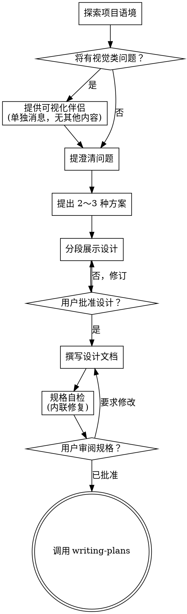

# 把想法脑暴成设计

通过自然协作对话，把想法变成成稿的设计与规格。

先理解当前项目语境，再**一次只问一个问题**打磨想法。理解要做什么之后，分段展示设计并取得用户认可。

<HARD-GATE>
在展示设计且**用户同意之前**，不得调用任何实现类技能、不得写代码、不得脚手架、不得采取任何实现动作。无论看起来多简单，**所有**项目都适用本门禁。
</HARD-GATE>

## 反模式：「这太简单不需要设计」

每个项目都要走本流程。待办列表、单函数小工具、改配置 —— **全部**。「简单」项目往往是**未检验假设**导致返工最多的地方。真简单的设计可以很短（几句话），但必须**展示并获批**。

## 检查清单

你必须为下列每一项**建任务并按顺序完成**：

1. **探索项目语境** — 看文件、文档、近期提交  
2. **提供可视化伴侣**（若后续会涉及视觉问题）— **单独一条消息**，不与澄清问题混在一起。见下文「可视化伴侣」。  
3. **提澄清问题** — 一次一个；弄清目的、约束、成功标准  
4. **提出 2～3 种方案** — 写取舍与你的推荐  
5. **展示设计** — 按复杂度分段；**每段后**询问是否 OK  
6. **撰写设计文档** — 保存到 `docs/superpowers/specs/YYYY-MM-DD-<topic>-design.md` 并提交  
7. **规格自检** — 快速扫占位、矛盾、含糊、范围（见下）  
8. **用户审阅成稿规格** — 请用户读过文件后再往下走  
9. **转入实现** — 调用 **writing-plans** 技能生成实现计划  

## 流程图

**终态是调用 writing-plans。** 不要调用 frontend-design、mcp-builder 等实现技能。脑暴之后**唯一**应再调用的技能是 **writing-plans**。

## 流程说明

**理解想法：**

- 先看清当前项目状态（文件、文档、近期提交）  
- 细问之前先评估范围：若需求含多个独立子系统（例如「平台要聊天、文件、计费、分析」），**立刻**标出；不要先把明显该拆分的项目细节问穿  
- 若单份规格过大，帮用户拆子项目：独立块有哪些、如何依赖、建议建造顺序；再对**第一个**子项目走正常脑暴。每个子项目各自 **规格 → 计划 → 实现**  
- 范围合适时，**一次一个问题**细化  
- 尽量用选择题，开放题也可  
- **每条消息只问一个问题**；一个话题要展开就拆成多条  
- 聚焦：目的、约束、成功标准  

**探索方案：**

- 提出 2～3 种不同做法与取舍  
- 口语化呈现选项，并给出推荐及理由  
- 先亮推荐选项，再解释为什么  

**展示设计：**

- 自认理解目标后，再展示设计  
- 每段长度随复杂度：直白可几句话，复杂可 200～300 字量级  
- **每段结束**问「到目前为止是否 OK」  
- 覆盖：架构、组件、数据流、错误处理、测试  
- 若有不通处，愿意退回澄清  

**为隔离与清晰而设计：**

- 拆成职责单一、接口明确、可独立理解与测试的小单元  
- 每个单元能回答：做什么？怎么用？依赖什么？  
- 外人能否不看实现就懂单元行为？改实现能否不破坏调用方？否则边界要重做  
- 小且边界清楚的单元也**更利于你**：上下文装得下，改动更可靠；文件膨胀往往说明做得太多  

**在既有代码库中：**

- 先摸清结构再提议；遵循既有模式  
- 若现有代码的问题**影响本目标**（单文件过大、边界不清、职责缠绕），把**针对性**改进纳入设计 —— 像好开发者顺手改良正在动的代码  
- 不要提议与当前目标无关的大重构  

## 设计完成之后

**文档：**

- 将经确认的设计（规格）写入 `docs/superpowers/specs/YYYY-MM-DD-<topic>-design.md`  
  （用户若指定其他规格路径，以用户为准）  
- 若有 `elements-of-style:writing-clearly-and-concisely` 等技能可配合使用  
- 将规格文档提交 git  

**规格自检：**  
写完规格后换眼光自查：

1. **占位扫描：** 是否有 `TBD`、`TODO`、空节或含糊需求？改掉。  
2. **内部一致：** 各节是否矛盾？架构是否与功能描述一致？  
3. **范围：** 是否仍适合**一份**实现计划，还是需要再拆？  
4. **歧义：** 是否有需求可作两种理解？若是，选定一种并写死。  

内联修掉即可，不必整套重审。

**用户审阅门禁：**  
自检通过后，请用户审阅已提交的规格文件：

> 「规格已写入并提交到 `<path>`。请过目；若要在写实现计划前修改，请直接说。」

等用户回复。若要求修改，改完再跑自检循环。**用户明确批准**后再进入实现。

**实现：**

- 调用 **writing-plans** 生成详细实现计划  
- **不要**调用其他技能。下一步只能是 writing-plans。  

## 关键原则

- **一次一个问题** — 不要一次抛一堆  
- **优先选择题** — 比开放题好答  
- **YAGNI 要狠** — 设计里砍掉非必要功能  
- **要比较方案** — 落定前总有 2～3 条路  
- **增量确认** — 设计分段展示、分段批准  
- **保持灵活** — 说不通就回去澄清  

## 可视化伴侣

浏览器里的辅助工具，用于脑暴中展示线框、示意图、视觉对比等。它是**工具**，不是「模式」。用户同意使用，只表示**在适合的问题**上可以用浏览器展示；**不表示**每个问题都要走浏览器。

**如何邀请：** 当你预感到接下来会有**视觉类**问题（线框、版式、示意图）时，**单独发一条消息**征求同意：

> 「接下来有些内容用网页展示可能更清楚。我可以边聊边做示意、对比图等。该能力较新且可能消耗较多 token。是否愿意试用？（需要打开本地 URL）」

**这条邀请必须独占整条消息**，不要与澄清问题、语境摘要等混发。发完后等用户回复；若拒绝，则全程文本脑暴。

**逐题决策：** 即使用户接受了伴侣，对**每一个**问题仍要判断：用浏览器还是终端。准则：**用户看图是否比读字更懂？**

- **用浏览器** — 内容本质是视觉：线框、版式对比、架构图、并排视觉稿  
- **用终端** — 内容是文本：需求取舍、概念选择、利弊列表、A/B/C/D 文字选项、范围决策  

「与 UI 有关」**不等于**视觉问题。「个性在此语境指什么？」是概念题 —— 用终端。「哪个向导版式更好？」是视觉题 —— 可用浏览器。

若用户同意使用伴侣，继续前请先阅读本技能包内详细说明：  
`.cursor/skills/rh-sup-brainstorming/visual-companion.md`
