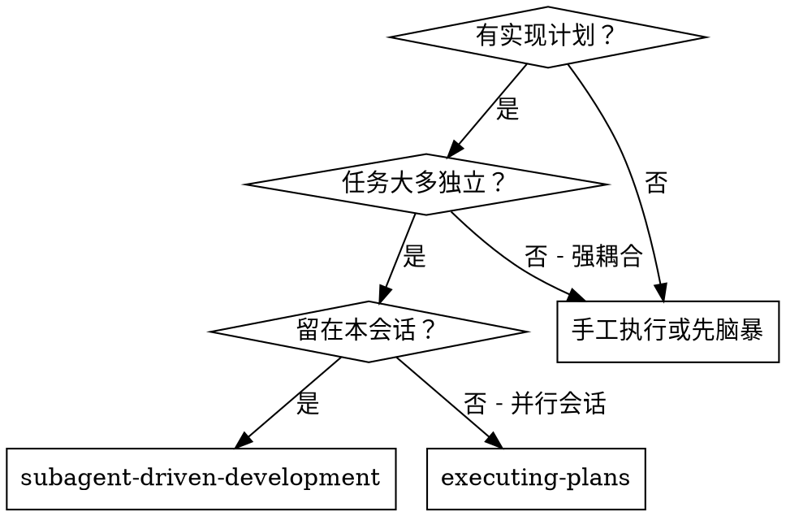
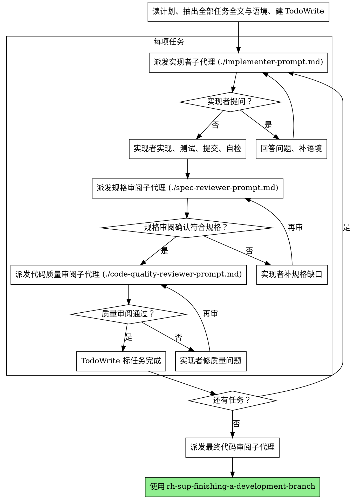

# 子代理驱动开发（Subagent-Driven Development）

按任务派发**全新语境**的子代理，每项任务后做**两阶段**审阅：先规格符合性，再代码质量。

**为何用子代理：** 把工作交给语境隔离的专业代理；通过精确编写指令与上下文，使其专注并成功。子代理**不得**继承本会话历史——你只给它需要的信息。你也保留语境做协调。

**核心原则：** 每任务一新子代理 + 两阶段审阅（先规格、后质量）= 高质量、快迭代。

## 何时使用

**与 Executing Plans（并行会话）对比：**

- 同一会话（无需切换语境）  
- 每任务新子代理（无语境污染）  
- 每任务后两阶段审阅：规格 → 质量  
- 迭代更快（任务间不必等人）  

## 流程

## 模型选择

在能完成角色的前提下用**最弱**模型，省成本、提速。

**机械实现**（孤立函数、规格清楚、1～2 文件）：快而廉的模型。规格写得好时多数任务属此类。

**整合与判断**（多文件协调、模式匹配、调试）：标准模型。

**架构、设计与审阅**：在可用范围内用最强的模型。

**复杂度信号：**

- 1～2 文件 + 完整规格 → 便宜模型  
- 多文件 + 整合顾虑 → 标准模型  
- 需设计判断或广读代码库 → 最强模型  

## 处理实现者状态

实现者子代理回报四种状态之一：

**DONE：** 进入规格符合性审阅。

**DONE_WITH_CONCERNS：** 活干完但有疑虑。先读疑虑；若涉正确性或范围，审阅前先处理；若只是观察（如「文件变大了」），记下再进审阅。

**NEEDS_CONTEXT：** 缺信息。补齐后**重新派发**。

**BLOCKED：** 无法完成。评估阻塞：

1. 语境不足 → 补语境后用**同档**模型再派  
2. 推理不够 → 换**更强**模型再派  
3. 任务过大 → 拆小  
4. 计划本身错 → **升级给人类**

**绝不**无视升级、或在无变更时强令同模型硬重试。实现者说卡住，**一定**要改条件。

## 提示词模板

- `./implementer-prompt.md` — 派发实现者  
- `./spec-reviewer-prompt.md` — 派发规格审阅  
- `./code-quality-reviewer-prompt.md` — 派发代码质量审阅  

## 示例工作流（摘要）

控制器：声明使用子驱动；读计划一次；抽出各任务全文与语境；建 TodoWrite。

每任务：派发实现者（附**完整**任务正文，不要让子代理自己去读计划文件）→ 若有提问先答 → 实现者实现、测、提交、自检 → 规格审阅 → 通过则质量审阅 → 循环直到双过 → 标任务完成。

全部任务后：可派最终审阅；再使用 **`rh-sup-finishing-a-development-branch`** 收尾。

## 优势

**相对手工：**

- 子代理自然贴近 TDD  
- 每任务新语境  
- 彼此并行安全、不踩脚  
- 子代理可在**开工前与工作中**提问  

**相对 Executing Plans：**

- 同会话、无交接等待  
- 审阅检查点自动化  

**质量闸：** 自检 + 规格审 + 质量审；审阅闭环确保修复有效；规格防多做/少做，质量保实现过硬。

**成本：** 每任务实现者 + 两名审阅者；控制器要预先抽任务；审阅循环可能多轮；但能早发现问题（比上线后便宜）。

## 红线

**绝不：**

- **未经用户明确同意**在 main/master 上开始实现  
- 跳过审阅（规格 **或** 质量）  
- 问题未修就进下一任务  
- **并行**派发多个**实现**子代理（会冲突）  
- 让子代理自己去读计划文件（应粘贴**全文**）  
- 省略场景设定（子代理需知任务在整体中的位置）  
- 无视子代理提问（答清再让其动手）  
- 规格审「差不多就行」（有问题 = 没完）  
- 跳过再审循环（有问题 → 实现者修 → **再审**）  
- 用实现者自检**代替**真实审阅（两者都要）  
- **规格未 ✅ 就先做质量审**（顺序错误）  
- 任一审阅仍有开放问题就进下一任务  

**子代理提问：** 答清楚、给足语境；别催着在未澄清时开工。

**审阅发现问题：** 同一实现者修 → 再审 → 循环至通过；**不得**跳过再审。

**子代理失败：** 带具体指令再派修复子代理；**不要**为省语境由控制器手改（污染语境）。

## 衔接

**依赖的工作流技能：**

- **`rh-sup-using-git-worktrees`** — 开始前建立隔离工作区（必选）  
- **`rh-sup-writing-plans`** — 生成本技能所执行的计划  
- **`rh-sup-requesting-code-review`** — 审阅子代理的模板参考  
- **`rh-sup-finishing-a-development-branch`** — 全部任务完成后收尾  

**子代理侧建议：**

- **`rh-sup-test-driven-development`** — 每任务遵循 TDD  

**替代路径：**

- **`rh-sup-executing-plans`** — 需要并行会话时用，而非本会话串行。  
