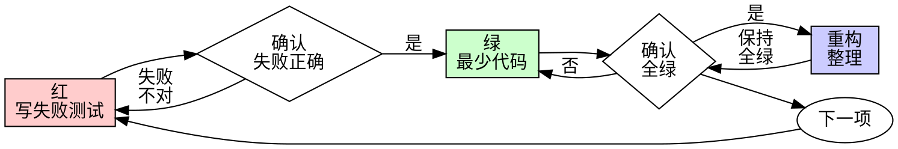

# 测试驱动开发（TDD）

## 概述

先写测试。看它失败。再写最少代码让它通过。

**核心原则：** 若你没**亲眼**看到测试失败，就不知道它测的是不是对的东西。

**违反字面即违反精神。**

## 何时使用

**总是：**

- 新功能  
- 缺陷修复  
- 重构  
- 行为变更  

**例外（须问协作伙伴）：**

- 一次性原型  
- 生成代码  
- 纯配置文件  

心想「这次先跳过 TDD」？停。那是自我合理化。

## 铁律

```text
NO PRODUCTION CODE WITHOUT A FAILING TEST FIRST
```

先写实现再补测？**删掉。重来。**

**没有例外：**

- 不要留着当「参考」  
- 不要边写测边「改编」那份实现  
- 不要偷看  
- **删**就是删  

从零、只根据测试写实现。句号。

## 红-绿-重构



### 红 — 写失败测试

写一个**最小**测试，表达「应该怎样」。

<Good>
```typescript
test('retries failed operations 3 times', async () => {
  let attempts = 0;
  const operation = () => {
    attempts++;
    if (attempts < 3) throw new Error('fail');
    return 'success';
  };

  const result = await retryOperation(operation);

  expect(result).toBe('success');
  expect(attempts).toBe(3);
});
```
命名清楚、测真实行为、只做一件事
</Good>

<Bad>
```typescript
test('retry works', async () => {
  const mock = jest.fn()
    .mockRejectedValueOnce(new Error())
    .mockRejectedValueOnce(new Error())
    .mockResolvedValueOnce('success');
  await retryOperation(mock);
  expect(mock).toHaveBeenCalledTimes(3);
});
```
名字含糊、测的是 mock 不是实现
</Bad>

**要求：**

- 单一行为  
- 名称可读  
- 真实代码（除非不得已不用 mock）  

### 确认红 — 必须看它失败

**强制。不可跳过。**

```bash
npm test path/to/test.test.ts
```

确认：

- 是**失败**（不是跑错抛错）  
- 失败信息与预期一致  
- 因**功能缺失**而失败（不是笔误）  

**一跑就过？** 你在测已有行为。改测试。

**报错/跑挂？** 先修到「正确失败」为止。

### 绿 — 最少实现

写**最简单**能通过测试的代码。

<Good>
```typescript
async function retryOperation<T>(fn: () => Promise<T>): Promise<T> {
  for (let i = 0; i < 3; i++) {
    try {
      return await fn();
    } catch (e) {
      if (i === 2) throw e;
    }
  }
  throw new Error('unreachable');
}
```
刚好够过测
</Good>

<Bad>
```typescript
async function retryOperation<T>(
  fn: () => Promise<T>,
  options?: {
    maxRetries?: number;
    backoff?: 'linear' | 'exponential';
    onRetry?: (attempt: number) => void;
  }
): Promise<T> {
  // YAGNI
}
```
过度设计
</Bad>

不要加功能、不要顺手重构别处、不要「比测试多走一步」。

### 确认绿 — 必须看它通过

**强制。**

```bash
npm test path/to/test.test.ts
```

确认：

- 本测通过  
- 其他测仍通过  
- 输出干净（无多余错误/警告）  

**仍失败？** 改实现，**不要**为通过而削弱测试。

**别测挂了？** 立刻修。

### 重构 — 仅在全绿后

全绿之后才：

- 去重  
- 改名  
- 抽辅助函数  

保持全绿。**不加**新行为。

### 循环

下一失败测试 → 下一小功能。

## 好测试

| 品质 | 好 | 差 |
|------|----|----|
| **最小** | 一件事；名字里出现「并且」？拆。 | `test('validates email and domain and whitespace')` |
| **清楚** | 名字描述行为 | `test('test1')` |
| **表意** | 展示期望 API | 看不出代码该做什么 |

## 顺序为何重要

**「我写完再补测试验证」**

后补的测试往往立刻就绿。立刻绿**证明不了任何事**：

- 可能测错对象  
- 可能测实现细节而非行为  
- 可能漏掉你已忘的边界  
- 你从没见过它**抓** bug  

测试先行逼你看到失败，才说明测试**真的在测东西**。

**「我手测过所有边界了」**

手测是随意的。你以为测全了：

- 没记录  
- 代码一改不能重跑  
- 压力下易漏  
- 「我当时试可以」≠ 全面  

自动化每次同样跑法。

**「删 X 小时成果太浪费」**

沉没成本。时间已花掉。现在二选一：

- 删掉用 TDD 重写（再花 X，但信心高）  
- 留着后补测（30 分钟，信心低，易埋雷）  

**浪费**是留着不可信的代码。能跑但没真测 = 技术债。

**「TDD 教条，务实要灵活」**

TDD **就是**务实：提交前找 bug（比上线后查快）、防回归、文档化行为、支撑重构。

「务实」抄近路 = 线上调试 = 更慢。

**「后补测目标一样，看精神不看形式」**

不。后补回答「**现在**做什么？」先行回答「**应该**做什么？」

后补被你的实现带偏：你测的是你写出来的，不是需求。你验证记得的边界，不是**发现**的边界。

先行逼你在实现前发现边界。后补验证你「是否记得全」（通常没有）。

后补三十分钟 ≠ TDD；你有覆盖率，**没有**「测试真的会失败」的证明。

## 常见自我合理化

| 借口 | 现实 |
|------|------|
| 「太简单不用测」 | 简单也会坏；写测只要几十秒。 |
| 「我稍后测」 | 立刻绿证明不了什么。 |
| 「后补目标一样」 | 后补=「现在做什么」；先行=「应该做什么」。 |
| 「已经手测过」 | 随意≠系统；无记录、不可重跑。 |
| 「删 X 小时浪费」 | 沉没成本；留着未验证代码才是债。 |
| 「留着参考、测试先写」 | 你会改编它=还是后补。**删**就是删。 |
| 「要先探索」 | 可以；探索完**扔掉**，从 TDD 开始。 |
| 「测试难写=设计不清」 | 听测试的；难写往往难用。 |
| 「TDD 拖慢我」 | TDD 比事后调试快；务实=先行。 |
| 「手测更快」 | 手测证明不了边界；每次改都要重手测。 |
| 「老代码没测」 | 你正在改进它；给老代码补测。 |

## 红线 — 停下重来

- 先写实现再写测  
- 实现后才写测  
- 一写测就过  
- 说不清测试为何失败  
- 测「以后再补」  
- 「就这一次」  
- 「我已经手测过」  
- 「后补目的一样」  
- 「精神到了就行」  
- 「留着参考」「边写测边改编」  
- 「都花 X 小时了删太亏」  
- 「TDD 教条我务实」  
- 「这次情况特殊…」  

**任一条 = 删实现。从 TDD 重来。**

## 示例：修 Bug

**缺陷：** 空邮箱仍通过

**红**
```typescript
test('rejects empty email', async () => {
  const result = await submitForm({ email: '' });
  expect(result.error).toBe('Email required');
});
```

**确认红**
```bash
$ npm test
FAIL: expected 'Email required', got undefined
```

**绿**
```typescript
function submitForm(data: FormData) {
  if (!data.email?.trim()) {
    return { error: 'Email required' };
  }
  // ...
}
```

**确认绿**
```bash
$ npm test
PASS
```

**重构**  
若需要，再抽出多字段校验等。

## 完成前核对

标完成前自查：

- [ ] 每个新函数/方法有测  
- [ ] 每个测试在实现前**见过红**  
- [ ] 失败原因符合预期（缺功能，不是手误）  
- [ ] 实现满足「最少过测」  
- [ ] 全测通过  
- [ ] 输出干净  
- [ ] 用真实代码（mock 仅不得已）  
- [ ] 边界与错误路径覆盖  

不能全勾？你跳了 TDD。**重来。**

## 卡住时

| 问题 | 做法 |
|------|------|
| 不知怎么写测 | 先写理想 API；先写断言；问协作伙伴。 |
| 测试太复杂 | 设计太复杂；简化接口。 |
| 必须全 mock | 耦合太重；用依赖注入等。 |
| 夹具巨大 | 抽辅助；仍复杂就简化设计。 |

## 与调试衔接

发现 bug？先写**失败**测试复现。走 TDD 循环。测试既证明修复又防回归。

**无测试不修 bug。**

## 测试反模式

加 mock 或测工具前，阅读本技能包内 **`testing-anti-patterns.md`**，避免：

- 测 mock 行为而非真实行为  
- 给生产类加「仅测试用」方法  
- 未理解依赖就乱 mock  

## 最后一条

```text
生产代码 → 先有测试且必须先见红
否则 → 不是 TDD
```

无协作伙伴许可，**没有例外**。
