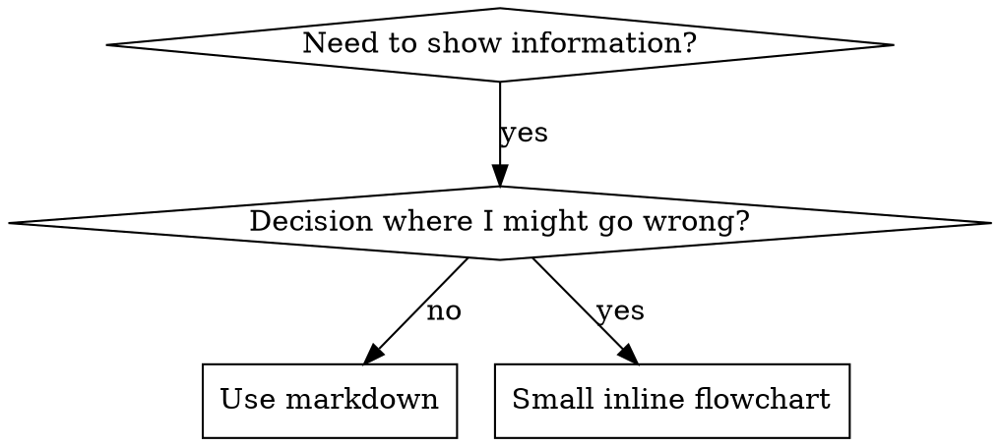

# 编写技能（Writing Skills）

## 概述

**编写技能 = 把测试驱动开发用在流程文档上。**

**个人技能目录因代理而异**（如 Claude Code 的 `~/.claude/skills`、Codex 的 `~/.agents/skills/`）。

你要写**测试用例**（带子代理的压力场景）、看它**失败**（无技能时的基线行为）、再写**技能**（`SKILL.md`）、看它**通过**（代理遵守），然后**重构**（堵漏洞）。

**核心原则：** 若你没见过「没有技能时代理如何失败」，就不知道技能是否教对了东西。

**必读背景：** 使用本技能前，**必须**理解 **`rh-sup-test-driven-development`**。该技能定义红-绿-重构循环；本技能把 TDD 适配到文档。

**官方指引：** Anthropic 的技能撰写最佳实践见同目录 **`anthropic-best-practices.md`**。本文在 TDD 取向之外补充模式与约束。

## 什么是「技能」？

**技能**是已验证技术、模式或工具的参考说明，帮助后续代理检索并应用有效做法。

**技能是：** 可复用技术、模式、工具、参考手册。  
**技能不是：** 你某次解决问题的叙事流水账。

## 与 TDD 的对应

| TDD 概念 | 技能编写 |
|----------|----------|
| **测试用例** | 带子代理的压力场景 |
| **生产代码** | 技能文档（`SKILL.md`） |
| **测试失败（红）** | 无技能时代理违反规则（基线） |
| **测试通过（绿）** | 有技能时代理遵守 |
| **重构** | 堵漏洞且保持遵守 |
| **先写测试** | 写技能**之前**先跑基线场景 |
| **必须见红** | 逐字记录代理的合理化借口 |
| **最少实现** | 只针对那些违规写技能 |
| **必须见绿** | 验证代理现已遵守 |
| **重构循环** | 发现新借口 → 补上 → 再验 |

整个技能创建流程遵循红-绿-重构。

## 何时创建技能

**应创建：**

- 对你并不显然的技巧  
- 你会在多个项目反复查阅  
- 模式足够通用（非单一项目）  
- 他人也会受益  

**不要为以下创建：**

- 一次性解法  
- 别处已有标准文档的常识  
- 项目专属约定（放 `CLAUDE.md` / 项目规则）  
- 可用正则/校验器机械强制执行的事（自动化；文档留给需要判断之处）

## 技能类型

### 技术（Technique）

可执行步骤的具体方法（如 condition-based-waiting、root-cause-tracing）。

### 模式（Pattern）

思考问题的方式（如 flatten-with-flags、test-invariants）。

### 参考（Reference）

API、语法、工具说明（如 office 文档类）。

## 目录结构

```text
skills/
  skill-name/
    SKILL.md              # 主参考（必填）
    supporting-file.*     # 仅在需要时
```

**扁平命名空间** — 所有技能处于同一可检索空间。

**拆成独立文件当：**

1. **重参考**（100+ 行）— API、完整语法  
2. **可复用工具** — 脚本、模板、实用程序  

**保留在正文内：**

- 原则与概念  
- 代码模式（< 50 行）  
- 其余能内联者  

## `SKILL.md` 结构

**YAML 头：**

- 必填：`name`、`description`（完整字段见 [agentskills.io/specification](https://agentskills.io/specification)）  
- 头信息总长 ≤ 1024 字符  
- `name`：仅字母、数字、连字符（无括号等特殊字符）；**本仓库**与技能包目录名一致，形如 `rh-sup-*` 或 `renthub-*`  
- `description`：第三人称，**只写何时用**（不写做什么）  
  - 以「在…时使用」或「Use when…」式触发条件开头（本仓库中文技能多用「在…时」）  
  - 写具体症状、情境、上下文  
  - **绝不概括技能流程**（见下文 CSO 一节原因）  
  - 尽量 < 500 字符  

```markdown
---
name: rh-sup-your-topic
description: 在 [具体触发条件与症状] 时使用
---

# 技能名称

## 概述
是什么？核心原则一两句。

## 何时使用
[若非显然，用小段内联流程图]

要点列表：症状与用例
何时不要用

## 核心模式（技术/模式类）
前后代码对照

## 速查
表格或要点，便于扫读

## 实现
简单模式内联代码
重参考或可复用工具则链接到文件

## 常见错误
易错点 + 修法

## 实际效果（可选）
可量化结果
```

## Claude 搜索优化（CSO）

**可发现性：** 后续代理靠 `description` 决定是否加载本技能。要回答：**「我现在该不该读它？」**

**格式：** 以触发条件开头（本仓库中文：`在…时使用`）。

**关键：`description` = 何时用，≠ 做什么**

`description` **只**写触发条件；**不要**概括技能的工作流。

**原因：** 实测若 `description` 概括了工作流，代理可能只照描述做**一次** code review，而忽略正文流程图里**两次** review（规格符合 + 代码质量）。把描述改成仅「在执行含独立任务的实现计划时使用」（无流程摘要）后，代理才会读流程图并执行两阶段。

**陷阱：** 描述里写流程 = 捷径；正文变成「可跳过文档」。

```yaml
# ❌ 差：概括流程 — 代理可能照此执行而不读全文
description: 在执行计划时使用 — 每任务派子代理并在任务间做 code review

# ❌ 差：过程过细
description: 用于 TDD — 先写测试、见红、最少代码、重构

# ✅ 好：仅触发条件，无流程摘要
description: 在当前会话中执行含独立任务的实现计划时使用

# ✅ 好：仅触发条件
description: 在实现任何功能或修复缺陷之前、尚未写实现代码时使用
```

**内容要点：**

- 具体触发、症状、情境  
- 描述**问题**（竞态、行为不一致），非**某语言症状**（除非技能本身语言相关）  
- 触发条件尽量与技术栈解耦；若技能绑定技术栈，在触发里写清楚  
- 第三人称（注入系统提示）  
- **绝不概括流程**

```yaml
# ❌ 差：过抽象
description: 用于异步测试

# ❌ 差：第一人称
description: 我可以在测试不稳定时帮你

# ❌ 差：技能不绑技术却写技术症状
description: 在测试里用 setTimeout/sleep 且不稳定时使用

# ✅ 好：以触发开头，描述问题，无流程
description: 在测试存在竞态、时间依赖或结果不稳定时使用

# ✅ 好：技术绑定技能，触发明确
description: 在使用 React Router 并处理认证重定向时使用
```

### 关键词覆盖

用代理会搜的词：

- 报错信息：`Hook timed out`、`ENOTEMPTY`、`race condition`  
- 症状：`flaky`、`hanging`、`zombie`、`pollution`  
- 同义：`timeout/hang/freeze`、`cleanup/teardown/afterEach`  
- 工具：真实命令、库名、文件类型  

### 命名

**主动、动词优先：**

- ✅ `creating-skills` 而非 `skill-creation`  
- ✅ `condition-based-waiting` 而非 `async-test-helpers`  

### Token 效率（重要）

**问题：** getting-started 等高频技能会进入**许多**会话；每个 token 都贵。

**字数目标：**

- getting-started 工作流：每段 <150 词  
- 高频技能总计：<200 词  
- 其他技能：<500 词（仍要简洁）  

**技巧：**

**细节移到工具 `--help`：**

```bash
# ❌ 差：在 SKILL 里罗列所有 flag
search-conversations 支持 --text、--both、--after DATE...

# ✅ 好：指向 --help
search-conversations 支持多种模式与过滤。运行 --help 查看详情。
```

**交叉引用：**

```markdown
# ❌ 差：重复写工作流
搜索时，派子代理用模板…
[重复 20 行]

# ✅ 好：引用其他技能
始终用子代理（省 50～100× 上下文）。**必须：** 用 [其他技能名] 处理工作流。
```

**压缩示例：**

```markdown
# ❌ 差：冗长（42 词）
伙伴：「我们以前在 React Router 里怎么处理认证错误？」
你：我会搜索历史对话里 React Router 认证模式。
[派子代理，查询：「React Router authentication error handling 401」]

# ✅ 好：极简（20 词）
伙伴：「以前在 React Router 里 auth 错误怎么处理？」
你：正在搜索…
[派子代理 → 汇总]
```

**去冗余：**

- 不重复交叉引用技能里已有的内容  
- 不解释命令行上一眼能看懂的  
- 同一模式不要多个雷同例子  

**自检：**

```bash
wc -w skills/path/SKILL.md
# getting-started：每工作流目标 < 150 词
# 其他高频：总计目标 < 200 词
```

**按「做什么」或核心洞见命名：**

- ✅ `condition-based-waiting` > `async-test-helpers`  
- ✅ `using-skills` 而非 `skill-usage`  

**动名词（-ing）适合流程类：** `creating-skills`、`testing-skills` 等。

### 交叉引用其他技能

写文档引用其他技能时：

- 用**技能名**，并标**必须**程度：  
  - ✅ `**必须子技能：** 使用 rh-sup-test-driven-development`  
  - ✅ `**必读背景：** 你必须掌握 rh-sup-systematic-debugging`  
- ❌ `See skills/testing/...`（是否必须不清）  
- ❌ `@skills/.../SKILL.md`（强制预加载，烧上下文）  

**为何不用 `@`：** `@` 会立刻整文件进上下文，动辄 200k+，在不需要时浪费。

## 何时用流程图



**仅当：**

- 决策点不显然  
- 可能过早停下的循环流程  
- 「何时 A vs B」  

**不要用流程图当：**

- 参考材料 → 表格、列表  
- 代码示例 → Markdown 代码块  
- 线性步骤 → 编号列表  
- 无语义标签（step1、helper2）  

样式规则见同目录 **`graphviz-conventions.dot`**。

**给伙伴出图：** 可用本目录 **`render-graphs.js`** 把技能里的图渲成 SVG：

```bash
./render-graphs.js ../some-skill           # 每图单独
./render-graphs.js ../some-skill --combine # 合并一张 SVG
```

## 代码示例

**一个精彩示例胜过多个平庸示例。**

按主题选语言：

- 测试技巧 → TypeScript/JavaScript  
- 系统调试 → Shell/Python  
- 数据处理 → Python  

**好示例：** 可运行、注释讲清**为何**、来自真实场景、模式清晰、可改编（非空模板）。

**不要：** 五种语言各一份、填空模板、做作例子。

你擅长移植——**一个**好例子足够。

## 文件组织

### 自包含技能

```text
defense-in-depth/
  SKILL.md    # 全部内联
```

适用：篇幅可控、无大部头参考。

### 带可复用工具

```text
condition-based-waiting/
  SKILL.md    # 概述 + 模式
  example.ts  # 可改编的现成辅助
```

适用：可执行代码工具，而非仅叙述。

### 带重参考

```text
pptx/
  SKILL.md       # 概述 + 工作流
  pptxgenjs.md   # 长 API
  ooxml.md       # XML 结构
  scripts/
```

适用：参考材料过大，不宜内联。

## 铁律（与 TDD 相同）

```text
NO SKILL WITHOUT A FAILING TEST FIRST
```

适用于**新技能**与对**既有技能的编辑**。

先写技能再测？**删掉。重来。**  
改技能不测？同样违规。

**没有例外：**

- 不是「小改动就可以不测」  
- 不是「只加一节」  
- 不是「只是文档更新」  
- 不要把未测改动当「参考」留着  
- 不要边跑测边「改编」  
- **删**就是删  

**必读背景：** `rh-sup-test-driven-development` 解释为何如此；文档同理。

## 按类型测试技能

### 纪律类（规则/要求）

**例：** TDD、`rh-sup-verification-before-completion`、先设计再写码。

**测法：**

- 学术问答：是否理解规则？  
- 压力场景：高压下是否仍遵守？  
- 多压组合：时间 + 沉没成本 + 疲劳  
- 记录合理化借口，并在技能里**逐条堵死**  

**成功标准：** 最大压力下仍遵守规则。

### 技术类（操作指南）

**例：** condition-based-waiting、root-cause-tracing、防御式编程。

**测法：**

- 应用题：能否正确应用技术？  
- 变体题：边界是否覆盖？  
- 信息缺失：说明是否有洞？  

**成功标准：** 在新场景下能正确应用。

### 模式类（心智模型）

**例：** 降复杂度、信息隐藏。

**测法：**

- 识别题：何时适用？  
- 应用题：能否用模型指导决策？  
- 反例：何时**不应**用？  

**成功标准：** 正确判断何时、如何用。

### 参考类（文档/API）

**例：** API、命令参考、库指南。

**测法：**

- 检索题：能否找到正确段落？  
- 应用题：能否正确使用查到的内容？  
- 缺口测：常见用例是否覆盖？  

**成功标准：** 找到并正确应用信息。

## 跳过测试的常见借口

| 借口 | 现实 |
|------|------|
| 「显然很清楚」 | 你清楚 ≠ 别的代理清楚。**测。** |
| 「只是参考」 | 参考也会有缺口、含糊段落。**测检索。** |
| 「测试小题大做」 | 未测技能几乎总有坑；测 15 分钟省数小时。 |
| 「有问题再测」 | 问题 = 代理用不了。**部署前**测。 |
| 「测太枯燥」 | 比线上修坏技能枯燥得多。 |
| 「我有信心」 | 过度自信必翻车。**照样测。** |
| 「学术读过就够」 | 读 ≠ 用。**测应用题。** |
| 「没时间测」 | 部署未测技能，事后补救更费时间。 |

**任一条 = 部署前必须测。无例外。**

## 让技能抗「合理化」

纪律类技能（如 TDD）须抗借口；代理很聪明，压力下会找漏洞。

**心理注：** 理解说服原理有助于系统堵洞。见 **`persuasion-principles.md`**（Cialdini 等）关于权威、承诺、稀缺、社会认同、一体性等。

### 显式封死每条退路

不只陈述规则——**禁止**具体 workaround：

<Bad>
```markdown
先写实现再写测？删掉。
```
</Bad>

<Good>
```markdown
先写实现再写测？删掉。重来。

**没有例外：**
- 不要当「参考」留着
- 不要边写测边「改编」
- 不要偷看
- 删就是删
```
</Good>

### 回应「精神 vs 字面」

在文首加基石原则：

```markdown
**违反字面就是违反精神。**
```

可砍掉一整类「我遵循精神」式借口。

### 建合理化对照表

从基线测试（见下）收集借口；代理说的每条都进表：

```markdown
| 借口 | 现实 |
|------|------|
| 「太简单不用测」 | 简单也会坏；测只要几十秒。 |
| 「我稍后测」 | 立刻绿证明不了什么。 |
| 「后补一样」 | 后补=「现在做什么」；先行=「应该做什么」。 |
```

### 列红线自检

让代理容易对照：

```markdown
## 红线 — 停下重来

- 先写实现再写测
- 「我已经手测过」
- 「后补目的一样」
- 「精神到了就行」
- 「这次情况特殊…」

**任一条 = 删实现。从 TDD 重来。**
```

### 在 `description` 里写「即将违规」的症状

```yaml
description: 在实现任何功能或修复缺陷之前、尚未写实现代码时使用
```

## 技能的红-绿-重构

遵循 TDD 循环：

### 红：写失败测试（基线）

**不带技能**用子代理跑压力场景。记录：

- 做了哪些选择？  
- 用了哪些合理化（**原文**）？  
- 哪些压力触发了违规？  

这就是「见红」——必须先看到**无技能时**代理自然怎么做。

### 绿：写最少技能

只针对那些具体违规写技能；不要为假想情况堆篇幅。

**带技能**跑同场景；代理应已遵守。

### 重构：堵新洞

发现新借口？加**显式**反驳。再测直到难钻空子。

**完整测法：** 见 **`testing-skills-with-subagents.md`**：

- 如何写压力场景  
- 压力类型（时间、沉没成本、权威、疲劳）  
- 系统堵洞  
- 元测试技巧  

## 反模式

### ❌ 叙事例子

「在 2025-10-03 那次 session，我们发现空 projectDir…」  
**差：** 过专、不可复用。

### ❌ 多语言稀释

`example-js.js`、`example-py.py`、`example-go.go`  
**差：** 质量平庸、维护重。

### ❌ 流程图里塞代码

```dot
step1 [label="import fs"];
```

**差：** 不能复制粘贴、难读。

### ❌ 泛标签

helper1、step3  
**差：** 标签应有语义。

## 停下：进入下一技能之前

**写完任一技能后，必须停下并完成部署流程。**

**不要：**

- 批量创建多个技能却不对每个单独测  
- 当前技能未验证就进入下一个  
- 以「批量更高效」跳过测试  

**下方部署清单对「每一个」技能都是强制的。**

部署未测技能 = 部署未测代码；违反质量标准。

## 技能创建清单（TDD 适配）

**重要：** 用 TodoWrite 为下列**每一项**建待办。

**红阶段 — 失败测试：**

- [ ] 写压力场景（纪律类至少 3 种压力组合）  
- [ ] **无技能**跑场景 — verbatim 记录基线  
- [ ] 归纳合理化/失败模式  

**绿阶段 — 最少技能：**

- [ ] `name` 仅用字母、数字、连字符  
- [ ] YAML 含必填 `name`、`description`（总长 ≤1024；见 [规范](https://agentskills.io/specification)）  
- [ ] `description` 以触发条件开头，含具体症状（不写流程摘要）  
- [ ] `description` 第三人称  
- [ ] 全文散落可检索词（错误、症状、工具）  
- [ ] 概述清楚、核心原则明确  
- [ ] 针对红阶段发现的失败点写对策  
- [ ] 代码内联**或**链到独立文件  
- [ ] 一个高质量示例（不要多语言凑数）  
- [ ] **带技能**跑场景 — 验证已遵守  

**重构阶段 — 堵洞：**

- [ ] 记录测试中**新**合理化  
- [ ] 加显式反驳（纪律类）  
- [ ] 汇总各轮测试成合理化表  
- [ ] 维护红线列表  
- [ ] 重测直到难找漏洞  

**质量：**

- [ ] 仅在不显然决策处用小流程图  
- [ ] 有速查表  
- [ ] 有「常见错误」  
- [ ] 无流水账叙事  
- [ ] 附属文件仅用于工具或重参考  

**部署：**

- [ ] 提交到 git 并 push（若已配置 fork）  
- [ ] 若普适性强，可考虑上游 PR  

## 发现路径（代理如何找到你的技能）

1. **遇到问题**（如「测试不稳定」）  
2. **匹配 `description`**  
3. **扫概述**（是否相关）  
4. **看模式/速查**  
5. **需要实现时再加载示例**  

**为此优化** — 可检索词尽早、尽量多次出现。

## 结语

**编写技能 = 对流程文档做 TDD。**

同一铁律：**无失败测试则无技能。**  
同一循环：红（基线）→ 绿（写技能）→ 重构（堵洞）。  
同一收益：质量更高、意外更少、更难被借口钻穿。

若你对代码用 TDD，对技能也应如此——同一套纪律，用在文档上。
