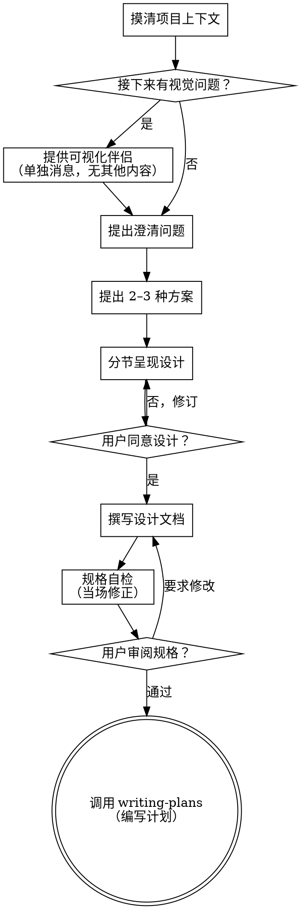

# 将想法脑暴成设计

通过自然的协作式对话，帮助把想法落实为完整的设计与规格。

先理解当前项目上下文，然后每次只问一个问题来细化想法。一旦清楚要构建什么，就呈现设计并征得用户同意。

<HARD-GATE>
在展示设计且用户同意之前，不要调用任何实现类技能、不要写代码、不要脚手架、不要采取任何实现动作。无论项目看起来多简单，都适用。
</HARD-GATE>

## 反模式：「这太简单了，不需要设计」

每个项目都要走这套流程。待办清单、单函数小工具、改配置——全部如此。「简单」项目里，未经审视的假设往往造成最多返工。设计可以很短（真正简单的项目几句话即可），但必须展示并征得同意。

## 检查清单

必须为下列每一项创建任务并按顺序完成：

1. **摸清项目上下文** — 查看文件、文档、近期提交
2. **提供可视化伴侣**（若话题会涉及视觉问题）— 单独一条消息，不与澄清问题合并。见下文「可视化伴侣」。
3. **提出澄清问题** — 一次一个，弄清目的/约束/成功标准
4. **提出 2–3 种方案** — 含取舍与你的推荐
5. **呈现设计** — 按复杂度分节，每节后征得同意
6. **撰写设计文档** — 保存到 `docs/superpowers/specs/YYYY-MM-DD-<topic>-design.md` 并提交
7. **规格自检** — 快速检查占位符、矛盾、歧义、范围（见下）
8. **用户审阅成文规格** — 请用户在继续前阅读规格文件
9. **转入实现** — 调用 writing-plans 技能生成实现计划

## 流程

**终止状态为调用 writing-plans（编写计划）。** 不要调用 frontend-design、mcp-builder 或其他实现类技能。脑暴之后唯一应接着调用的技能是 writing-plans。

## 流程要点

**理解想法：**

- 先查看当前项目状态（文件、文档、近期提交）
- 在问细节前评估范围：若请求描述多个彼此独立的子系统（例如「做一个带聊天、文件、计费、分析的平台」），立即指出。不要先把一个本应先拆分的项目问到很细。
- 若项目过大、无法单次成文，帮用户拆成子项目：各自独立部分是什么、如何关联、应按什么顺序做？再对第一个子项目走正常设计流。每个子项目各自：规格 → 计划 → 实现。
- 对规模合适的项目，一次一个问题细化想法
- 尽量用选择题，开放式也可以
- 每条消息只问一个问题——若某话题需要多轮，拆成多个问题
- 重点弄清：目的、约束、成功标准

**探索方案：**

- 提出 2–3 种不同方案及取舍
- 用对话方式呈现选项，给出你的推荐与理由
- 先亮推荐选项并解释原因

**呈现设计：**

- 一旦认为已理解要构建什么，就呈现设计
- 每节篇幅随复杂度伸缩：简单则几句话，微妙处可到 200–300 字
- 每节后问「到目前为止是否合适」
- 覆盖：架构、组件、数据流、错误处理、测试
- 若有不清楚之处，准备好回头澄清

**为隔离与清晰而设计：**

- 把系统拆成更小单元，各单元目的单一、通过明确接口通信、可独立理解与测试
- 对每个单元应能回答：做什么、怎么用、依赖什么？
- 能否不看内部就理解单元行为？改内部是否会破坏调用方？若否，边界需再打磨。
- 更小、边界清晰的单元也更利于你工作——上下文能装下的代码更好推理，文件职责单一则编辑更可靠。文件膨胀往往是「做得太多」的信号。

**在现有代码库中工作：**

- 提出变更前先摸清当前结构，遵循既有模式。
- 若现有代码存在影响当前工作的问题（例如单文件过大、边界不清、职责纠缠），把有针对性的改进纳入设计——就像优秀开发者在动手处顺手改进代码。
- 不要提议无关重构，紧扣当前目标。

## 设计完成之后

**文档：**

- 将已确认的设计（规格）写入 `docs/superpowers/specs/YYYY-MM-DD-<topic>-design.md`
  - （用户对规格路径的偏好优先于本默认）
- 若可用，使用 elements-of-style:writing-clearly-and-concisely 技能
- 将设计文档提交到 git

**规格自检：**
写完规格后，换视角通读：

1. **占位扫描：** 是否有「TBD」「TODO」、未完成章节或模糊需求？补上。
2. **内部一致性：** 各节是否矛盾？架构是否与功能描述一致？
3. **范围：** 是否足够聚焦、适合单次实现计划，还是需要再拆分？
4. **歧义：** 是否有需求可被两种不同方式理解？若是，选定一种并写清楚。

当场修正即可，不必反复多轮自检——修完继续。

**用户审阅关卡：**
自检通过后，请用户在继续前阅读已写入的规格：

> 「规格已写入并提交到 `<path>`。请审阅；若要在开始写实现计划前修改，告诉我。」

等待用户回复。若要求修改，修改后重新跑规格自检循环。仅当用户确认通过后再继续。

**实现：**

- 调用 writing-plans 技能生成详细实现计划
- 不要调用其他技能。下一步只能是 writing-plans。

## 核心原则

- **一次一个问题** — 不要一次抛多个问题把人淹没
- **优先选择题** — 在可行时比开放式更容易回答
- **无情 YAGNI** — 从所有设计中拿掉非必要功能
- **探索替代方案** — 落定前总要提出 2–3 种做法
- **增量确认** — 先呈现设计、获批准再推进
- **保持灵活** — 有不清楚处就回头澄清

## 可视化伴侣

基于浏览器的伴侣，用于在脑暴中展示线框、示意图与视觉选项。它是工具而非模式。用户接受伴侣只表示「在需要时可以用浏览器」；不表示每个问题都要走浏览器。

**提供伴侣：** 若预感到后续问题会涉及视觉内容（线框、版式、示意图），征得同意时只提一次：
> 「接下来有些内容如果在网页里展示可能会更好理解。我可以随对话生成线框、示意图、对比和其他视觉稿。该功能仍较新，且可能消耗较多 token。要试试吗？（需要打开本地 URL）」

**本条邀请必须单独成消息。** 不要与澄清问题、上下文摘要或其他内容合并。消息中应只含上述邀请，别无他物。等用户回复后再继续。若拒绝，则仅用文字继续脑暴。

**逐题决策：** 即使用户已接受，对**每一道题**单独判断是否用浏览器。检验标准：**用户是「看到」比「读到」更懂吗？**

- **用浏览器** 当内容本身是视觉的——线框、线框图、版式对比、架构图、并排视觉稿
- **用终端** 当内容是文字——需求问题、概念选择、取舍列表、A/B/C/D 文字选项、范围决策

关于 UI 的话题不等于自动是视觉题。「个性在这里指什么？」是概念题——用终端。「哪种向导版式更好？」是视觉题——用浏览器。

若用户同意使用伴侣，继续前请先阅读同目录说明：
`visual-companion.md`
