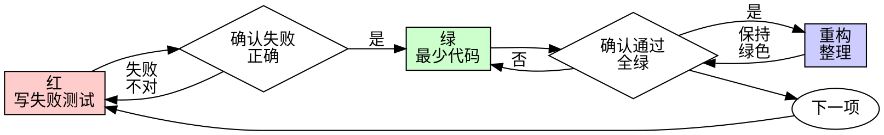

# 测试驱动开发（TDD）

## 概述

先写测试。看它失败。再写最少代码让它通过。

**核心原则：** 若你没看到测试失败，就不知道它测的是不是对的东西。

## 何时使用

**始终使用：**
- 新功能
- 缺陷修复
- 重构
- 行为变更

**例外（询问你的协作伙伴）：**
- 一次性原型
- 生成代码
- 配置文件

心想「就这一次跳过 TDD」？停。那是自我合理化。

## 铁律

```
没有先失败的测试，就没有生产代码
```

先写代码再写测试？删掉。重来。

**没有例外，必须遵循：**
- 不要留着当「参考」
- 不要边写测试边「改编」它
- 不要去看它
- 删就是删

完全依据测试重新实现。没有商量。

## 红-绿-重构



### 红 — 写失败测试

写一个最小测试，展示应该怎样行为。

<Good>
```typescript
test('retries failed operations 3 times', async () => {
  let attempts = 0;
  const operation = () => {
    attempts++;
    if (attempts < 3) throw new Error('fail');
    return 'success';
  };

  const result = await retryOperation(operation);

  expect(result).toBe('success');
  expect(attempts).toBe(3);
});
```
名称清晰，测真实行为，单一件事
</Good>

<Bad>
```typescript
test('retry works', async () => {
  const mock = jest.fn()
    .mockRejectedValueOnce(new Error())
    .mockRejectedValueOnce(new Error())
    .mockResolvedValueOnce('success');
  await retryOperation(mock);
  expect(mock).toHaveBeenCalledTimes(3);
});
```
名称模糊，测的是 mock 不是代码
</Bad>

**要求：**
- 单一行为
- 名称清楚
- 真实代码（除非不得已，否则不用 mock）

### 确认红 — 看它失败

**强制。不得跳过。**

```bash
npm test path/to/test.test.ts
```

确认：
- 测试失败（而非报错）
- 失败信息符合预期
- 因功能缺失而失败（而非笔误）

**测试通过了？** 你在测已有行为。改测试。

**测试报错？** 修报错，重跑直到「正确地失败」。

### 绿 — 最少代码

写最简单代码让测试通过。

<Good>
```typescript
async function retryOperation<T>(fn: () => Promise<T>): Promise<T> {
  for (let i = 0; i < 3; i++) {
    try {
      return await fn();
    } catch (e) {
      if (i === 2) throw e;
    }
  }
  throw new Error('unreachable');
}
```
刚好够通过
</Good>

<Bad>
```typescript
async function retryOperation<T>(
  fn: () => Promise<T>,
  options?: {
    maxRetries?: number;
    backoff?: 'linear' | 'exponential';
    onRetry?: (attempt: number) => void;
  }
): Promise<T> {
  // YAGNI
}
```
过度设计
</Bad>

不要加功能、不要重构其他代码、不要超出测试「改良」。

### 确认绿 — 看它通过

**强制。**

```bash
npm test path/to/test.test.ts
```

确认：
- 该测试通过
- 其他测试仍通过
- 输出干净（无错误、无警告）

**测试失败？** 改代码，不改测试。

**其他测试失败？** 立刻修。

### 重构 — 整理

仅在变绿之后：
- 消除重复
- 改进命名
- 抽取辅助函数

保持测试绿色。不增加行为。

### 重复

下一失败测试对应下一功能点。

## 好测试

| 质量 | 好 | 差 |
|---------|------|-----|
| **最小** | 一件事。名称里有「并且」？拆开。 | `test('validates email and domain and whitespace')` |
| **清晰** | 名称描述行为 | `test('test1')` |
| **表达意图** | 展示期望的 API | 掩盖代码应做什么 |

## 为何顺序重要

**「写完代码再写测试验证能跑」**

后补的测试一上来就通过。立即通过证明不了什么：
- 可能测错对象
- 可能测实现而非行为
- 可能漏掉你忘掉的边界
- 你从没看到它抓住 bug

测试先行逼你看到失败，证明它确实在测东西。

**「我已经手动测过所有边界」**

手动测试是随意的。你以为全覆盖了，其实：
- 没有测了什么记录
- 代码变更后不能重跑
- 压力下容易忘 case
- 「我当时试过了」≠ 全面

自动化测试是系统的。每次同样方式运行。

**「删掉 X 小时工作是浪费」**

沉没成本谬误。时间已经花掉。你现在只能选：
- 删掉用 TDD 重写（再花 X 小时，信心高）
- 留着后补测试（30 分钟，信心低，易有 bug）

「浪费」是留着无法信任的代码。没有真测试的能跑代码是技术债。

**「TDD 教条，务实要变通」**

TDD **就是**务实：
- 提交前发现 bug（比上线后调试快）
- 防止回归（测试立刻发现破坏）
- 文档化行为（测试展示如何用代码）
- 便于重构（大胆改，测试抓破坏）

「务实」捷径 = 生产环境调试 = 更慢。

**「后补测试目标一样——重在精神不是仪式」**

不。后补回答「这代码做什么？」先行回答「这应该做什么？」

后补受实现偏见影响。你测的是你写的，不是需求。你验证记得的边界，不是发掘的边界。

先行迫使在实现前发现边界。后补验证你是否记得一切（你并没有）。

后补 30 分钟 ≠ TDD。你有覆盖率，失去了「测试确实有效」的证明。

## 常见自我合理化

| 借口 | 现实 |
|--------|---------|
| 「太简单不用测」 | 简单代码也会坏。测只要 30 秒。 |
| 「我等会再测」 | 一上来就通过的测试证明不了什么。 |
| 「后补目标一样」 | 后补 =「做什么？」先行 =「应做什么？」 |
| 「已经手动测过」 | 随意 ≠ 系统。无记录，不能重跑。 |
| 「删 X 小时是浪费」 | 沉没成本。留着未验证代码是技术债。 |
| 「留着参考，先写测试」 | 你会改编它。那就是后补。删就是删。 |
| 「需要先探索」 | 可以。扔掉探索稿，从 TDD 开始。 |
| 「难测 = 设计不清」 | 听测试的。难测 = 难用。 |
| 「TDD 拖慢我」 | TDD 比调试快。务实 = 先行测试。 |
| 「手动更快」 | 手动证明不了边界。每次改都要重测。 |
| 「现有代码没测试」 | 你在改进它。给现有代码补测试。 |

## 红灯 — 停下重来

- 先写代码后写测试
- 实现之后才写测试
- 测试立刻通过
- 说不清测试为何失败
- 测试「稍后再加」
- 合理化「就这一次」
- 「我已经手动测过」
- 「后补目的一样」
- 「重在精神不是仪式」
- 「留着参考」或「改编现有代码」
- 「已经花了 X 小时，删了浪费」
- 「TDD 教条，我这才叫务实」
- 「这次不一样因为…」

**以上任一条都意味着：删代码。用 TDD 重来。**

## 示例：修 bug

**Bug：** 空邮箱被接受

**红**
```typescript
test('rejects empty email', async () => {
  const result = await submitForm({ email: '' });
  expect(result.error).toBe('Email required');
});
```

**确认红**
```bash
$ npm test
FAIL: expected 'Email required', got undefined
```

**绿**
```typescript
function submitForm(data: FormData) {
  if (!data.email?.trim()) {
    return { error: 'Email required' };
  }
  // ...
}
```

**确认绿**
```bash
$ npm test
PASS
```

**重构**
若需要，可为多字段抽取校验。

## 验收检查清单

在标记工作完成前：

- [ ] 每个新函数/方法有测试
- [ ] 实现前看到每个测试失败
- [ ] 每个测试因预期原因失败（功能缺失，非笔误）
- [ ] 对每个测试写了最少通过代码
- [ ] 全部测试通过
- [ ] 输出干净（无错误、无警告）
- [ ] 测试使用真实代码（仅不得已时 mock）
- [ ] 覆盖边界与错误

不能全勾？你跳过了 TDD。重来。

## 卡住时

| 问题 | 对策 |
|---------|----------|
| 不知怎么测 | 写期望的 API。先写断言。问协作伙伴。 |
| 测试太复杂 | 设计太复杂。简化接口。 |
| 必须全 mock | 耦合太重。用依赖注入。 |
| 测试搭建巨大 | 抽辅助函数。仍复杂则简化设计。 |

## 与调试衔接

发现 bug？写失败测试复现。走 TDD 循环。测试既证明修复又防回归。

永远不要无测试修 bug。

## 测试反模式

增加 mock 或测试工具时，阅读 @testing-anti-patterns.md，避免常见坑：
- 测 mock 行为而非真实行为
- 给生产类加仅测试用的方法
- 未理解依赖就 mock

## 最后一条

```
生产代码 → 存在对应测试且曾先失败
否则 → 不是 TDD
```

未经协作伙伴允许，没有例外。
