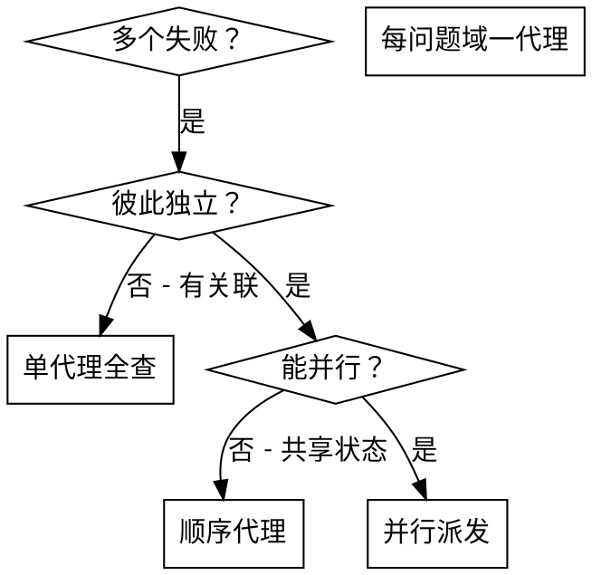

# 并行派发代理（Dispatching Parallel Agents）

## 概述

将工作委派给**语境隔离**的专业代理；通过精确编写指令与上下文，使其专注并成功完成任务。代理**不得**继承本会话的上下文或历史——你只提供其所需信息。这样也为你保留协调工作的语境。

当存在多个互不相关的失败（不同测试文件、不同子系统、不同缺陷）时，按顺序排查会浪费时间；每次排查彼此独立，可以并行进行。

**核心原则：** 每个独立问题域派发**一个**代理；允许它们并发工作。

## 何时使用



**适用于：**

- 3 个以上测试文件失败，且根因不同
- 多个子系统彼此独立地损坏
- 每个问题可在不了解其他问题上下文的情况下理解
- 排查之间无共享状态

**不适用于：**

- 失败彼此相关（修一个可能带动其他）
- 需要理解完整系统状态
- 代理会互相干扰

## 模式

### 1. 识别独立域

按「什么坏了」分组失败：

- 文件 A 的测试：工具审批流
- 文件 B 的测试：批处理完成行为
- 文件 C 的测试：中止功能

各域独立——修审批不会影响中止测试。

### 2. 编写聚焦的代理任务

每个代理获得：

- **明确范围：** 单个测试文件或子系统
- **清晰目标：** 使这些测试通过
- **约束：** 不改其他代码
- **期望输出：** 发现与修复的摘要

### 3. 并行派发

```typescript
// 在 Claude Code / AI 环境中
Task("修复 agent-tool-abort.test.ts 的失败")
Task("修复 batch-completion-behavior.test.ts 的失败")
Task("修复 tool-approval-race-conditions.test.ts 的失败")
// 三者并发运行
```

### 4. 审阅与集成

代理返回后：

- 阅读各摘要
- 确认修复无冲突
- 跑完整测试套件
- 集成全部变更

## 代理提示词结构

好的代理提示词具备：

1. **聚焦** — 单一清晰问题域
2. **自包含** — 理解问题所需的全部上下文
3. **输出明确** — 代理应返回什么？

```markdown
修复 src/agents/agent-tool-abort.test.ts 中 3 个失败用例：

1. "should abort tool with partial output capture" - 期望消息中含 'interrupted at'
2. "should handle mixed completed and aborted tools" - 快工具被中止而非完成
3. "should properly track pendingToolCount" - 期望 3 个结果实际为 0

属于时序/竞态类问题。你的任务：

1. 阅读测试文件，理解各用例验证什么
2. 识别根因 — 时序问题还是真实缺陷？
3. 修复方式：
   - 用基于事件的等待替代任意超时
   - 若发现中止实现有 bug 则修复
   - 若测的是已变行为则调整期望

不要只靠加大超时 — 找到真正原因。

返回：根因与修复摘要。
```

## 常见错误

**❌ 过宽：**「修所有测试」— 代理迷失  
**✅ 具体：**「修 agent-tool-abort.test.ts」— 范围聚焦

**❌ 无上下文：**「修竞态」— 代理不知位置  
**✅ 有上下文：** 粘贴错误信息与用例名

**❌ 无约束：** 代理可能大重构  
**✅ 有约束：**「不要改生产代码」或「只修测试」

**❌ 输出含糊：**「修好它」— 你不知道改了什么  
**✅ 输出明确：**「返回根因与变更摘要」

## 何时不要用

**相关失败：** 修一个可能修好其他 — 先一起排查  
**需要全局语境：** 理解依赖看到整个系统  
**探索式调试：** 尚不清楚哪里坏了  
**共享状态：** 代理会互相干扰（改同一文件、争用同一资源）

## 会话中的真实示例

**场景：** 大重构后 3 个文件共 6 个测试失败

**失败：**

- agent-tool-abort.test.ts：3 个（时序）
- batch-completion-behavior.test.ts：2 个（工具未执行）
- tool-approval-race-conditions.test.ts：1 个（执行次数为 0）

**判断：** 独立域 — 中止逻辑、批完成、竞态彼此分离

**派发：**

```
代理 1 → 修 agent-tool-abort.test.ts
代理 2 → 修 batch-completion-behavior.test.ts
代理 3 → 修 tool-approval-race-conditions.test.ts
```

**结果：**

- 代理 1：用基于事件的等待替代超时
- 代理 2：修事件结构 bug（threadId 位置错误）
- 代理 3：增加等待异步工具执行完成

**集成：** 修复彼此独立、无冲突，全绿

**节省时间：** 3 个问题并行耗时接近 1 个问题的顺序耗时

## 主要收益

1. **并行化** — 多项排查同时进行
2. **聚焦** — 每代理范围窄、上下文少
3. **独立性** — 代理互不干扰
4. **速度** — 并行解决多个问题

## 验证

代理返回后：

1. **审阅各摘要** — 理解变更
2. **检查冲突** — 是否改了同一处代码？
3. **跑全量套件** — 合并后仍通过
4. **抽查** — 代理也可能犯系统性错误

## 实际效果

来自调试会话（2025-10-03）：

- 3 个文件共 6 个失败
- 并行派发 3 个代理
- 调查均并发完成
- 集成全部修复成功
- 代理间变更零冲突
