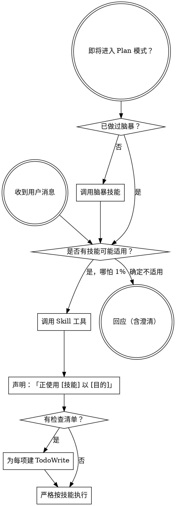

<SUBAGENT-STOP>
若你是作为子代理被派发来执行具体任务，跳过本技能。
</SUBAGENT-STOP>

<EXTREMELY-IMPORTANT>
只要你认为某技能有**哪怕 1%** 可能适用于当前工作，就**必须**调用该技能。

若技能适用于你的任务，**你没有选择**，**必须使用**。

没有商量余地。不是可选项。不要自我合理化绕开。
</EXTREMELY-IMPORTANT>

## 指令优先级

Superpowers 类技能可覆盖默认系统提示行为，但 **用户指令永远优先**：

1. **用户显式说明**（CLAUDE.md、GEMINI.md、AGENTS.md、直接要求）— 最高
2. **Superpowers 技能** — 与默认系统行为冲突时以技能为准
3. **默认系统提示** — 最低

若 CLAUDE.md / GEMINI.md / AGENTS.md 写「不要用 TDD」，而技能写「永远 TDD」，则**听用户的**。用户说了算。

## 如何访问技能

**在 Claude Code：** 使用 `Skill` 工具。调用后内容会加载给你——直接照做。**不要**用 Read 工具去读技能文件。

**在 Copilot CLI：** 使用 `skill` 工具。技能从已装插件自动发现；行为与 Claude Code 的 `Skill` 类似。

**在 Gemini CLI：** 通过 `activate_skill` 激活；会话启动时加载元数据，按需拉取全文。

**其他环境：** 查各平台文档如何加载技能。

## 平台适配

技能正文使用 Claude Code 工具名。非 CC 平台：见 `references/copilot-tools.md`（Copilot CLI）、`references/codex-tools.md`（Codex）中的工具对应表。Gemini CLI 用户通常由 GEMINI.md 自动加载映射。

# 使用技能（Using Skills）

## 规则

**在回应或行动之前，先调用相关或被点名的技能。** 哪怕只有 1% 可能适用，也应先调用核实。若调用后发现不适用，可不必按其执行。

## 危险想法 — 停下

下列念头表示你在**自我合理化**：

| 想法 | 现实 |
|------|------|
| 「这只是个简单问题」 | 提问也是任务。先查技能。 |
| 「我需要先多要点上下文」 | **先**技能检查，**再**澄清。 |
| 「我先快速看代码/仓库」 | 技能会告诉你**如何**探索。先查。 |
| 「我快速看下 git/文件」 | 文件没有对话语境。先查技能。 |
| 「我先收点信息」 | 技能会告诉你**如何**收集。 |
| 「不用正式技能吧」 | 只要有技能，就用。 |
| 「我记得这技能」 | 技能会变。读**当前**版本。 |
| 「这不算任务」 | 行动 = 任务。先查技能。 |
| 「技能小题大做」 | 简单事也会变复杂。用。 |
| 「我先干一件小事」 | **任何**事前都先检查。 |
| 「这样很高效」 | 无纪律动作浪费时间。技能防这个。 |
| 「我懂概念就行」 | 懂概念 ≠ 已用技能。**要调用**。 |

## 多技能时的顺序

多个技能都可能适用时：

1. **流程类优先**（脑暴、调试）— 决定**如何**接近问题  
2. **实现类其次**（如 frontend-design、mcp-builder）— 指导**怎么**写

「我们做个 X」→ 先脑暴，再实现类技能。  
「修这个 bug」→ 先调试，再领域技能。

## 技能类型

**刚性**（TDD、调试）：严格照做。不要为省事削弱纪律。

**灵活**（模式类）：原则可因语境调整。

技能正文会说明属于哪一类。

## 用户指令

指令说 **WHAT**，不是 **HOW**。「加 X」「修 Y」**不**表示可以跳过工作流技能。
